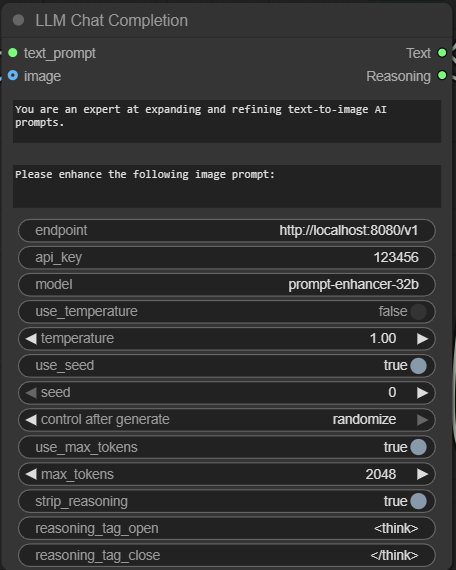
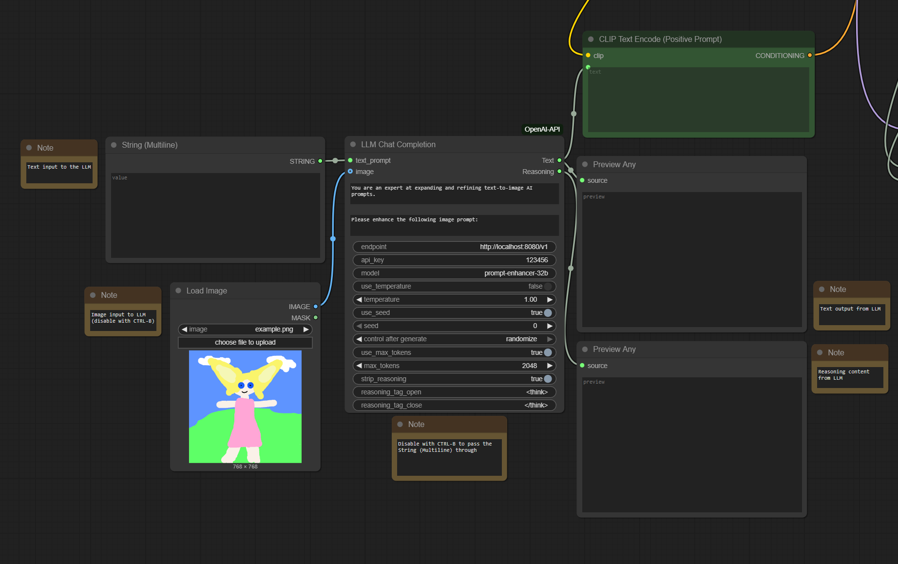
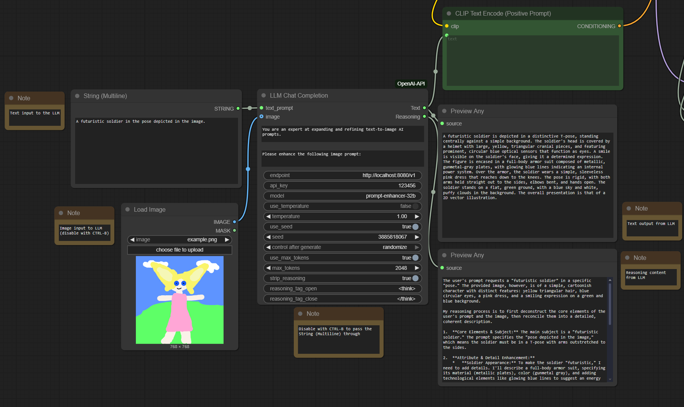

# ComfyUI LLM Chat Completion Node

This is a custom node that calls an LLM and outputs the resulting text.

## Features

- Supports any OpenAI-compatible endpoint (including those you host locally, such as with llama.cpp, LMStudio, or other programs)
- Extracts reasoning content from the output of thinking models
- Supports either text-only input or text + image input for VLMs

## Installation

1. Navigate to your custom_nodes folder
2. Clone this repo: `git clone https://github.com/bgreene2/ComfyUI-OpenAI-API.git`
3. Change to the directory `cd ComfyUI-OpenAI-API`
4. Assuming the correct Python environemnt is loaded, install dependencies `pip install -r requirements.txt`
5. Restart ComfyUI

## Usage Guide

The node has the following inputs:

- text_prompt - Your prompt to send to the LLM
- image (optional) - An image to send to the LLM

The node has the following parameters:

- system_prompt - If given, this will be sent to the LLM as the system prompt
- pre_prompt - If given, this will be added before the text_prompt to construct the actual user message sent to the LLM
- endpoint - The hostname or ip address where the API is located. You may need to include "/v1" at the end.
- model - The name of the AI model to request at the API
- use_temperature - Whether to send a temperature
- temperature - The temperature to send
- use_seed - Whether to send an RNG seed. If this is not specified, the default behavior of the endpoint will be used, which is probably to use a random seed.
- seed - The seed to send
- control after generate - This is attached to the 'seed' parameter
- use_max_tokens - Whether to send max_tokens
- max_tokens - The value for max_tokens to send
- strip_reasoning - Whether to post-process the returned text to split out the reasoning and non-reasoning content
- reasoning_tag_open - The string that starts reasoning content
- reasoning_tag_close - The string that ends reasoning content

The node has the following outputs:

- Text - The text content after calling the LLM
- Reasoning - The reasoning content after calling the LLM

For basic usage, leave everything default except for `endpoint` and `model`. Connect a `String (multiline)` node to the `text_prompt` input. Connect the `Text` output to two nodes: a `Preview Any` node, and the text input of your text encoder node (might be named like `CLIP Text Encode` or similar).

See [this example workflow](workflows/flux_dev_example_openai_api.json). It is the ComfyUI Flux Dev example, with this node added.

## Recommended Usage

This node is ideal for prompt enhancement, i.e. you write a basic prompt and the LLM jazzes it up to give more detailed or varied images. There exist nodes to do this that run the LLM within the workflow, allowing its memory to be managed intelligently. Those are a better option if you are running everything on one computer. This node is a good option if you are using an API hosted on a different machine.

## Recommended Models

This node was tested with [PromptEnhancer-32B](https://huggingface.co/PromptEnhancer/PromptEnhancer-32B), at GGUF Q8_0 quantization.

## Credit

- Originally based on https://github.com/tianyuw/ComfyUI-LLM-API
